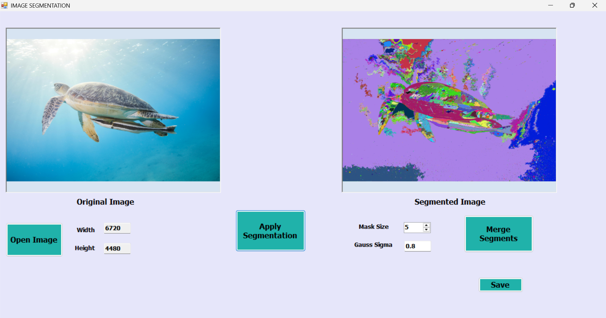
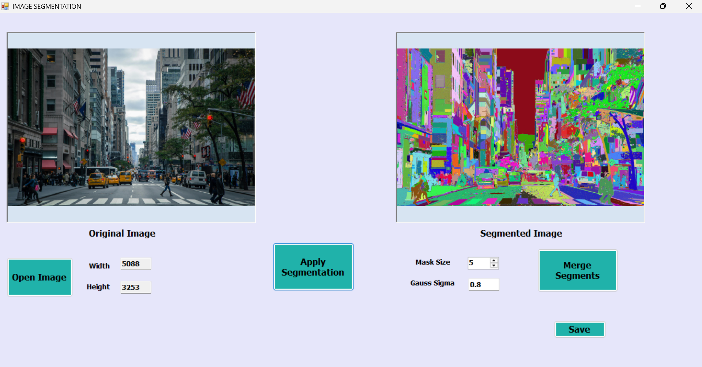
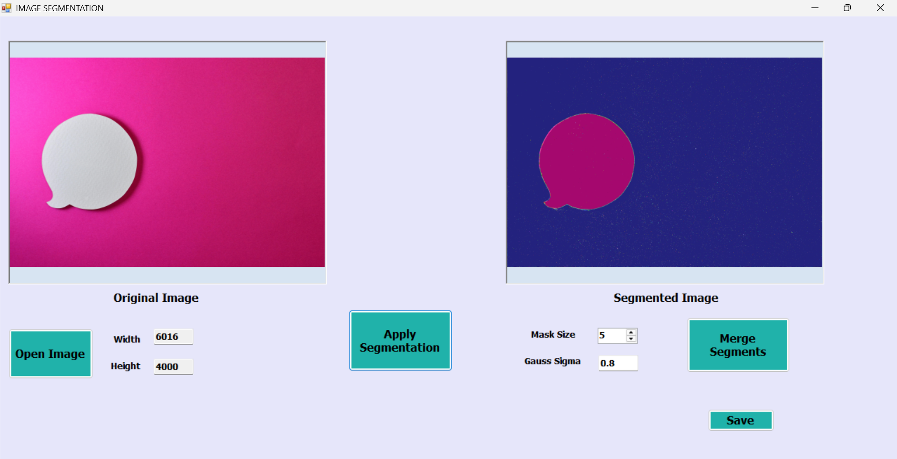

# 🎨 Image Segmentation using Graph-Based Region Merging

> Efficient and adaptive image segmentation with Kruskal-based graph merging and interactive WinForms UI.

---

## 🛠️ Setup Instructions

> ✅ Built with **C# (.NET Framework 4.8)**  
> 🖼️ UI: **Windows Forms (WinForms)**  
> 💻 OS: Windows 10 or later

### ⚙️ To run:

1. Open the `.sln` file using **Visual Studio 2019+**.
2. Make sure target framework is set to **.NET Framework 4.8**.
3. Run the `MainForm.cs`.
4. Load any image (`.jpg`, `.png`, `.bmp`) and start segmenting.

---

## 📷 Screenshots





---


## 🧠 Project Overview

This project implements **graph-based image segmentation** based on the method by *Felzenszwalb and Huttenlocher*, providing:

- Accurate and scalable segmentation
- Visualization of distinct regions via coloring
- User interaction to highlight or extract segments
- Output of segmentation statistics

It segments color images by analyzing R/G/B channels separately and intersecting the results.

---

## ✨ Features

- ✅ Gaussian filter smoothing (1D) with configurable σ and mask size
- 📊 Graph construction with 8-connected pixel neighbors
- 🧠 Intelligent region merging based on internal/external difference
- 🖌️ Segment coloring with optional manual selection
- 📄 Output file with total components and sorted sizes
- ⚡ Parallel processing across R/G/B channels
- 🔍 High-resolution image support (tested up to 6720×4480)
- 🪢Choose Segments From the image

---

## 📈 Algorithm Details

### 🧮 Step-by-step pipeline

1. **Gaussian Smoothing**: Reduces noise using a separable 1D Gaussian filter.
2. **Graph Construction**:
   - Each pixel = node
   - Connect to 8 neighbors
   - Edge weight = `|I(pi) - I(pj)|` (per channel)
3. **Segmentation per Channel**:
   - Sort edges by weight
   - Merge with DSU using internal difference + adaptive threshold
4. **Color Image Merging**:
   - Segment R, G, B channels separately
   - Intersect segment labels for final result
5. **Colorize Output**: Assign a unique color to each segment
6. **Interactive UI**:
   - Click to select segments
   - Highlight and export selected area

---

### 🔬 Why Kruskal?

Unlike basic region-growing, this method:
- Is **global** (looks at the entire image graph)
- Uses **adaptive merging** (based on size & internal variability)
- Produces meaningful regions — not just locally similar pixels

### 📚 Based on:
> P. Felzenszwalb and D. Huttenlocher,  
> *Efficient Graph-Based Image Segmentation*,  
> Int. Journal of Computer Vision, 2004.

---

## 🗂️ Project Structure

```
ImageSegmentation/
│
├── Segmenter.cs             # Core segmentation logic
├── DisjointSet.cs           # DSU with path compression
├── GraphBuilder.cs          # Builds 8-connected graph
├── ImageOperations.cs       # Image load + Gaussian blur
├── MainForm.cs              # WinForms UI  
├── output.txt               # Segment sizes
├── screenshots/             # Sample output images
```
---
## 💻 How to Use

1. **Open the program**
2. **Click “Open”** → Choose an image
3. **Adjust Gaussian Filter settings** if needed
4. **Click “Apply Segmentation”**
5. **Click Merge Segments to choose specific segments**
6. **Use mouse to click on regions to highlight**
7. **Click Save to save the segmented image**

---
